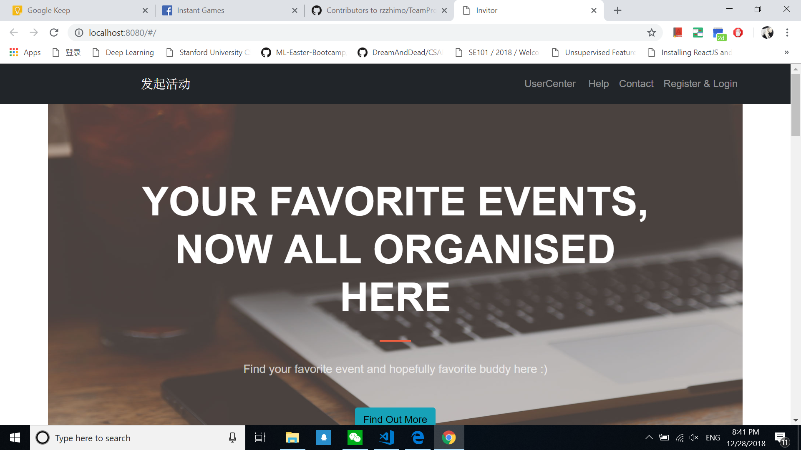
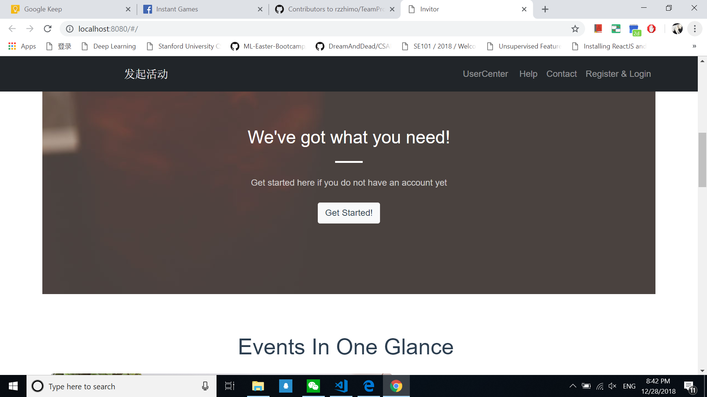
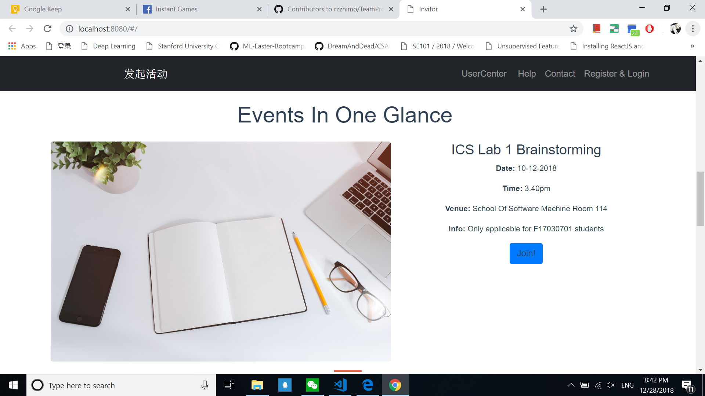
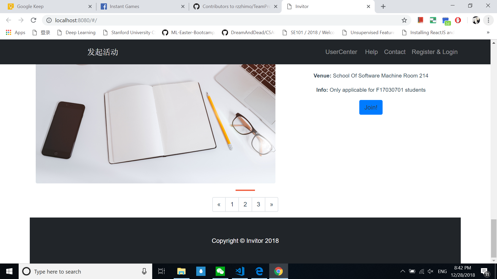
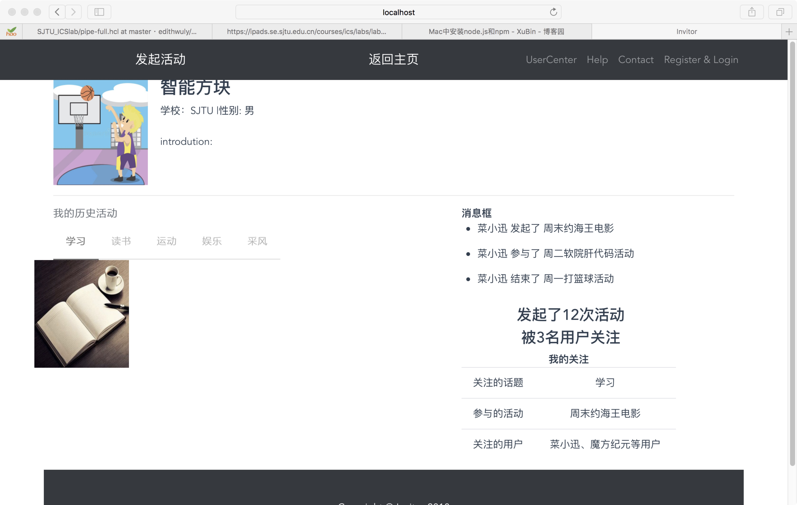

# Invitor

A reactive mini-invitation-network created with Vue!!

## Introduction

University is a new environment for us. Unfortunately, student often lack of a medium to invite friends for activities such as sport, studying, singing or even simple task like eating lunch together. This is further confirmed after we have distributed questions for our housemates, coursemates and discussion with course teacher. This is why we are here to change the situation by mean of software(web application).

## Survey

To further investigate the usefulness of this idea, we have randomly selected 15 students from Shanghai Jiao Tong University to give their opinions. Below are breakdown of some important points which may spark some interest:

### Table of survey result

| Attributes | no Of Respondents Who Agree | no Of Respondent Who Disagree | no Of Respondent Who Not Sure | Result |
|---|---|---|---|---|
| Usefulness | 12 | 0 | 3 | Useful |
| Feasibility | 15 | 0 | 0 | Feasible |
| Similarity with existing application | 7 | 3 | 5 | Might be similar |
| Ability to compete | 10 | 0 | 5 | Able to compete |
| Technical difficulties | 6 | 6 | 3 | Might not be difficult |
| User experience | 12 | 3 | 0 | Will improve lifestyle |
| Interest in our product | 15 | 0 | 0 | Very interested |
| Would you use it? | 5 | 5 | 5 | Will try to use |

### Conclusion  

This idea is doable and most probably able to spark some interest among our users especially students in Shanghai Jiao Tong University. Althought our survey sample size is small and not really targeted evenly among users in all backgrounds but the result seems promising. After we have consulted our tutor in charge, Ren Rui from School Of Software, SJTU, we can conclude that this is indeed a promising idea and hopefully we might be able to bring  more people together.

## Screenshots and Overview












## Usage and Installation

1. First install all dependencies:

```
# with npm package manager
> npm install
```

2. Start the server:

```
> npm start 
[OR] 
> npm run dev
```

3. Now run the app:

```
# In browser, visit:
http://localhost:8080/#/
```

4. Enjoy!

## Feature Request

Due to time constraint and lack of required skillsets among our us, we only manage to produce front-end of this web application.

However, feel free to open an issue to ask for a new feature support.

## Contribution

> [rzzhimo](https://github.com/rzzhimo)  
> [kmykoh97](https://github.com/kmykoh97)  
> [GHB123123](https://github.com/GHB123123)  

## Special Thanks

Ren Rui from School of Software Engineering Shanghai Jiao Tong University for guiding us throughout this project.